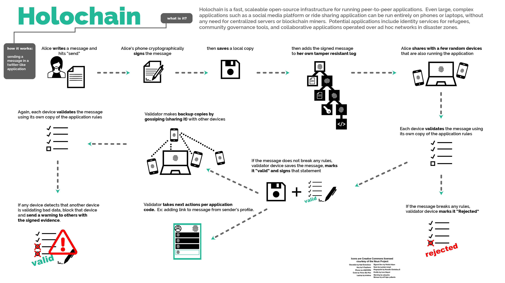

# Holochain

> Holochain is a framework for building fully decentralized, peer-to-peer apps. In its architecture, Holochain leans away from the severely limiting and often destructive consensus-based and data-centric practices made popular by blockchain technologies. Holochain is unique in that it utilizes DHTs for collective data storage and proliferation while maintaining agent-centric data integrity via personal hash chains held by each node.

> * Holochain is not a blockchain. On a blockchain, every node on a network maintains the same state of the entire network. On Holochain, each node maintains its own history in a personal, cryptographically tamper-proof chain.
> * DHTs \(Distributed Hash Tables\) are implemented on Holochain to create shared public space. Each node carries some of the shared data so that if a node goes offline, its data isn't lost to the community. This is configurable for each app's use-case.
> * Distributed validation built in to Holochain means that every user of an app agrees to that app's validation rules. If these rules are broken, other nodes can tell how and by whom, and then react accordingly.
> * Each Holochain app is its own network.

There is no overall, global "correctness" \(or consensus\) built in to Holochain. Instead, each node that receives a record of a transaction validates it against the shared application rules and gossips it to their peers. If the rules are broken, that transaction is rejected by the validator. If foul play is detected on a node's part \(the node is either propagating or validating bad data\) that node is blocked and a warning is sent to others. 

> Holochains don't manage consensus, at least not about some absolute perspective on data or sequence of events. They manage distributed data integrity. Holochains do rely on consensus about the validation rules \(DNA\) which define that integrity, but so does every blockchain or blockchain alternative \(e.g. Bitcoin Core\). If you have different validation rules, you're not on the same chain. These validation rules establish the "data physics," and then applications are built on that foundation.
>
> Each source chain for each person/agent/participant in a Holochain preserves the immutable data integrity and order of events of that agent's actions from their vantage point. As data is published from a source chain to the validating DHT, then other agents sign their validation, per the shared "physics" encoded into the DNA of that Holochain.
>
> The minor exception to the singular vantage point of each chain, is the case when a multi-party transaction is signed to each party's chain. That is an act of consensus -- but consensus on a very small scale -- just between the parties involved in the transaction. Each party signs the exact same transaction to with links to each of their previous chain entries. Luckily, it's pretty easy to reach consensus between 2 or 3 parties. In fact, that is already why they're doing a transaction together, because they all agree to it.
>
> Holochains do sign every change of data and timestamp \(without a universal time synchronization solution\), This provides ample foundation for most applications which need solid data integrity for shared data in a fully distributed multi-agent system. Surely, there will be people who will build consensus algorithms on top of foundation \(maybe like rounds, witnesses, supermajorities of Swirld\),

From [https://developer.holochain.org/guide/latest/faq.html\#what-is-holochains-consensus-algorithm](https://developer.holochain.org/guide/latest/faq.html#what-is-holochains-consensus-algorithm)

### Nodes

* Nodes run on individual chains and require no miners to validate transactions
* Each nodes process its own ledger, this favor higher scalability and transactions per seconds
* Network congestion is reduced since data is distributed among various nodes

### Pros

* Holochain **eliminates the need for all nodes to be synchronized with each other** in global consensus. Sharding is usually enabled on Holochain. This means that when two nodes make a transaction, each node saves a countersigned record of that transaction. Additionally, the transaction is published to the [Distributed Hash Table](https://www.youtube.com/watch?v=FhF_kvgfEZM) \(sent to and saved by some unpredictably random nodes that can be looked up later for retrieval\).
* Because of DHTs, and the sharding they enable, Holochain actually doesn't rely on the transfer of large amounts of redundant information, and uses vastly less bandwidth than blockchain.
* **No mining on Holochain.** Blockchain's proof-of-work system provides a hefty incentive for thousands of people to spend the processing power of their CPUs and GPUs using up huge amounts of electricity on solving a meaningless cryptographic puzzle.

### Cons

* Force you to rethink your system in order to use Holochain: your system can not be designed around data having one absolute true state. In Holochain state is dynamic and varied based on vantage point

### Used in

* Holochain [https://www.holochain.org/](https://www.holochain.org/)

### Links

This page compares Holochain to various other decentralized data protocols and systems.  [https://github.com/Holochain/holochain-proto/wiki/Comparisons](https://github.com/Holochain/holochain-proto/wiki/Comparisons)

